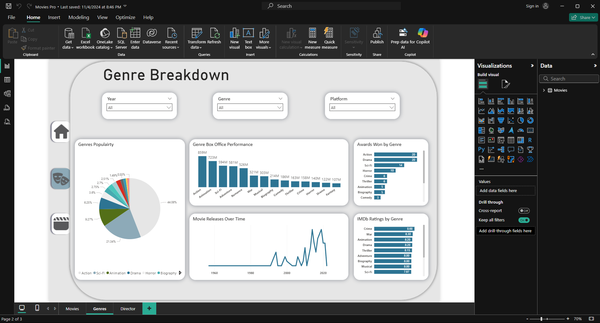
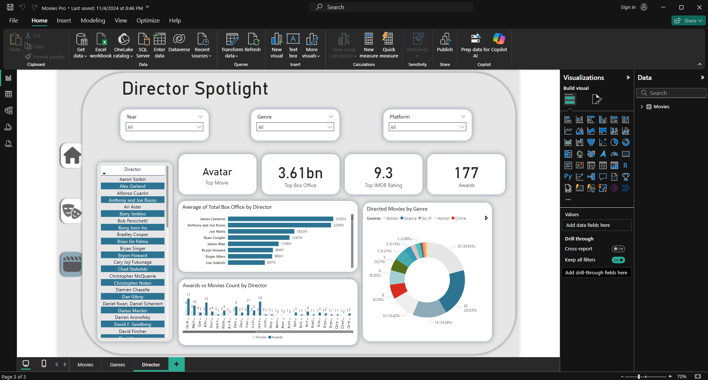

# Movie Performance Analytics

This Power BI project analyzes movie performance, ratings, and box office data.  
The dashboard provides insights into scores, revenue, genre trends, and director impact.

---

## Dashboard Highlights
- **Movie Scores & Revenue** → Track IMDb, Rotten Tomatoes, and Metacritic ratings alongside total box office revenue.  
- **Genre & Releases** → Analyze genre performance, release trends, and award distribution.  
- **Directors** → Compare director performance by box office, awards, and number of movies.  

---

## Files in Repository
- `Movies Project.pbix` → Power BI report file  
- `Movies Breakdown.xlsx` → Cleaned and merged Excel source dataset  
- Screenshots: `movie.png`, `genre.png`, `director.png`  

---

## Dashboard Screenshots

### Movie Scores & Revenue  
  

### Genre & Releases  
  

### Directors  
  

---

## How to Use
1. Download the `.pbix` file  
2. Open it in **Power BI Desktop**  
3. Explore the visuals interactively  

---

## Skills Demonstrated
- Data cleaning, merging, and modeling in Excel and Power BI  
- Creating calculated columns and DAX measures  
- Interactive dashboard design and visualization  
- Data storytelling and performance analysis across movies, genres, and directors  

---

Created as part of a professional **data analysis portfolio** showcasing Power BI and Excel expertise.
